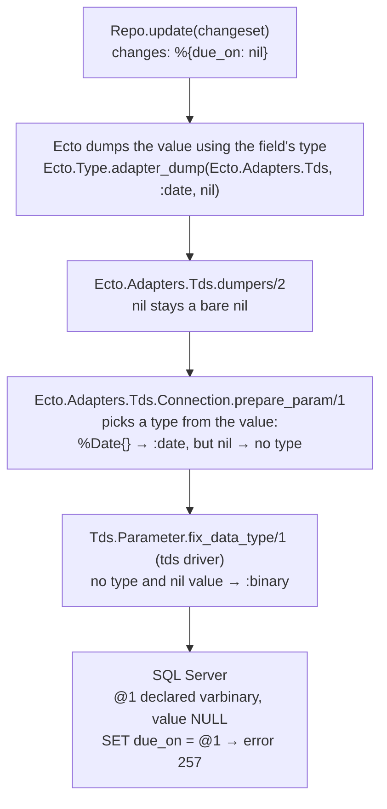

# Root cause

Source links point at the released versions this repo uses: ecto 3.14.2,
ecto_sql 3.14.0, and tds master at [`f67d0a7`](https://github.com/elixir-ecto/tds/tree/f67d0a7cd0)
(the same code as tds 2.3.8 on Hex for everything referenced here). Every
reference is also listed in [references.md](references.md).

## Symptom

Writing `nil` to some columns through Ecto fails on SQL Server:

```
** (Tds.Error) Line 1 (Error 257): Implicit conversion from data type varbinary to date is not allowed. Use the CONVERT function to run this query.
```

For `float`, `real`, `text` and `ntext` columns the message is different:

```
** (Tds.Error) Line 1 (Error 206): Operand type clash: varbinary is incompatible with float
```

Both are standard SQL Server errors ([errors 0 to 999](https://learn.microsoft.com/en-us/sql/relational-databases/errors-events/database-engine-events-and-errors-0-to-999)):
257 is "Implicit conversion from data type %ls to %ls is not allowed" and 206 is
"Operand type clash: %ls is incompatible with %ls". The original report in
tds#124 also shows error 8180, "Statement(s) could not be prepared", because
the failure happens while SQL Server prepares the statement.

It happens whenever a query carries `nil` as a parameter: `Repo.update/2`
changing a field to nil, `Repo.insert_all/3` with a nil value, or
`Repo.update_all/3` setting a field to nil.

## Where the type gets lost

SQL Server needs a data type for every parameter. The tds driver prepares
statements with `sp_prepare` by default ([protocol.ex#L198](https://github.com/elixir-ecto/tds/blob/f67d0a7cd0/lib/tds/protocol.ex#L198),
[#L569](https://github.com/elixir-ecto/tds/blob/f67d0a7cd0/lib/tds/protocol.ex#L569)),
whose parameter definitions name each parameter's type
([sp_prepare](https://learn.microsoft.com/en-us/sql/relational-databases/system-stored-procedures/sp-prepare-transact-sql),
[sp_executesql](https://learn.microsoft.com/en-us/sql/relational-databases/system-stored-procedures/sp-executesql-transact-sql):
"Each parameter definition consists of a parameter name and a data type").
On the wire, every RPC parameter carries a `TYPE_INFO`, including a NULL one
([MS-TDS: RPC Request](https://learn.microsoft.com/en-us/openspecs/windows_protocols/ms-tds/619c43b6-9495-4a58-9e49-a4950db245b3)).

Ecto knows each field's type from the schema, but on released ecto_sql that
knowledge doesn't survive to the point where the parameter is declared:



| Step | Code |
|---|---|
| Ecto dumps changes and query parameters through the adapter, with the field's type | [`Ecto.Type.adapter_dump/3`](https://github.com/elixir-ecto/ecto/blob/v3.14.2/lib/ecto/type.ex#L1041-L1049), called from [`Ecto.Repo.Schema`](https://github.com/elixir-ecto/ecto/blob/v3.14.2/lib/ecto/repo/schema.ex#L1365-L1366) and the [query planner](https://github.com/elixir-ecto/ecto/blob/v3.14.2/lib/ecto/query/planner.ex#L2638) |
| The Tds adapter's dumpers leave date, time and float values untouched, so nil stays nil | [`Ecto.Adapters.Tds.dumpers/2`](https://github.com/elixir-ecto/ecto_sql/blob/v3.14.0/lib/ecto/adapters/tds.ex#L155-L157) |
| The connection picks a parameter type from the value's struct; nil matches none and falls through with no type | [`prepare_param/1`](https://github.com/elixir-ecto/ecto_sql/blob/v3.14.0/lib/ecto/adapters/tds/connection.ex#L102-L117), [`prepare_raw_param/1`](https://github.com/elixir-ecto/ecto_sql/blob/v3.14.0/lib/ecto/adapters/tds/connection.ex#L146) |
| The driver keeps an explicit type, but gives an untyped nil the type `:binary` | [`Tds.Parameter.fix_data_type/1`](https://github.com/elixir-ecto/tds/blob/f67d0a7cd0/lib/tds/parameter.ex#L79-L88), added in [`97c736b`](https://github.com/elixir-ecto/tds/commit/97c736be2a) (2018) |
| `:binary` is declared as varbinary | [`encode_param_descriptor/1`](https://github.com/elixir-ecto/tds/blob/f67d0a7cd0/lib/tds/types.ex#L978) |

The `:binary` fallback fixed an Ecto `has_one` nullify case: foreign keys are
integers, and SQL Server does accept a varbinary NULL for integer columns.
See [upstream-history.md](upstream-history.md).

## Why only some column types fail

When a value is inserted into a column, SQL Server converts it to the column's
type ([data type conversion](https://learn.microsoft.com/en-us/sql/t-sql/data-types/data-type-conversion-database-engine):
"inserting a value into a column result[s] in the data type that was defined by
the ... column definition"). Microsoft's conversion chart on that page is an
image; `mix run scripts/conversion_matrix.exs` checks the cells that matter
here against a real server. In short:

| Refuses a varbinary NULL | Accepts it |
|---|---|
| `date`, `time`, `datetime2`, `datetimeoffset` (error 257) | `datetime`, `smalldatetime` |
| `float`, `real`, `text`, `ntext` (error 206) | `int`, `bigint`, `bit`, `decimal`, `money` |
| | `nvarchar`, `varchar`, `uniqueidentifier`, `varbinary`, `image` |

`text` and `image` "don't support automatic data type conversion"
([CAST and CONVERT](https://learn.microsoft.com/en-us/sql/t-sql/functions/cast-and-convert-transact-sql#text-and-image-data-types)).
Casting doesn't help `float` and `real` either: SQL Server rejects
`CAST(varbinary AS float)` outright with error 529, "Explicit conversion from
data type %ls to %ls is not allowed".

Combined with the column types ecto_sql's migrations create
([`ecto_to_db/5`](https://github.com/elixir-ecto/ecto_sql/blob/v3.14.0/lib/ecto/adapters/tds/connection.ex#L1825-L1842)),
this is which schema fields break on released ecto_sql
([Ecto primitive types](https://ecto.hexdocs.pm/Ecto.Schema.html#module-primitive-types)):

| Ecto field type | Column Ecto creates | Setting it to nil |
|---|---|---|
| `:date` | `date` | fails |
| `:time` | `time(0)` | fails |
| `:time_usec` | `time(6)` | fails |
| `:naive_datetime` | `datetime` | works |
| `:naive_datetime_usec` | `datetime2(6)` | fails |
| `:utc_datetime` | `datetime` | works |
| `:utc_datetime_usec` | `datetime2(6)` | fails |
| `:float` | `float` | fails |
| `:integer`, `:boolean`, `:decimal`, `:string`, `:binary`, `:binary_id`, `:map` | `int`, `bit`, `decimal`, `nvarchar`, `varbinary`, `uniqueidentifier`, `nvarchar(max)` | works |

`timestamps()` uses `:naive_datetime` by default
([`timestamps/1`](https://ecto.hexdocs.pm/Ecto.Schema.html#timestamps/1)),
which maps to the legacy `datetime` type. That is a large part of why the bug is
easy to miss.

Columns created by hand or by other tools follow the first table instead. For
example, a `:string` field on a legacy `text` column also fails, and so does a
`:date` field on a `datetime2` column that was declared outside Ecto.

## Why plain inserts don't fail

`Repo.insert/2` converts a struct "into a changeset with all non-nil fields"
([`insert/2`](https://ecto.hexdocs.pm/Ecto.Repo.html#c:insert/2),
[relation.ex#L647](https://github.com/elixir-ecto/ecto/blob/v3.14.2/lib/ecto/changeset/relation.ex#L647-L649)),
so no parameter is sent for nil fields and the column gets its default of NULL.
Only writes that explicitly carry a nil hit the bug.

## Why the driver can't fix it

By the time a nil reaches the tds driver it is just `nil`, with no type. TDS
encodes NULL differently depending on the declared type: a 2-byte marker for
`varchar`/`nvarchar`/`varbinary`, a 4-byte marker for `text`/`ntext`/`image`, and
another form for everything else
([MS-TDS: Data Type Dependent Data Streams](https://learn.microsoft.com/en-us/openspecs/windows_protocols/ms-tds/3f983fde-0509-485a-8c40-a9fa6679a828)).
So the driver has to pick some type, and every choice is refused by some
column: `:binary` (today) breaks the columns above, and `:string`, proposed in
tds#162, breaks `binary`, `varbinary` and `image` columns. The conversion
matrix shows both.

## Why the adapter can fix it

Until Ecto 3.11, `Ecto.Type.adapter_dump/3` returned early for nil, so an
adapter's dumpers never saw one. [ecto#4214](https://github.com/elixir-ecto/ecto/pull/4214)
removed that shortcut ("Adapters now receive `nil` for encoding/decoding",
Ecto 3.11.0), and ecto_sql adjusted the Tds loaders for it the same day
([ecto_sql#528](https://github.com/elixir-ecto/ecto_sql/pull/528)). Since
then, `Ecto.Adapters.Tds.dumpers/2` runs for nil values with the field's type
in hand, which is exactly the information the driver lacks.

The [`dumpers/2` callback](https://ecto.hexdocs.pm/Ecto.Adapter.html#c:dumpers/2)
"returns a list of dumpers with the given type usually at the beginning", and
its own example appends a function that re-encodes values for the database.

## The fix

The fix has two halves, both in the vendored ecto_sql (`git log -p --
vendor/ecto_sql` shows the two commits after the vendoring one: `4d570f4`, the
first version, and its follow-up):

1. **The adapter tags the nil.** [`Ecto.Adapters.Tds.dumpers/2`](../vendor/ecto_sql/lib/ecto/adapters/tds.ex)
   appends a dumper for the eight affected Ecto types. It leaves non-nil
   values alone and turns a nil into a tuple of the nil and its Ecto type,
   such as `{nil, :date}`. This is the convention `Tds.Ecto.VarChar` already
   uses when it dumps a string as `{value, :varchar}`
   ([types.ex#L287-L289](https://github.com/elixir-ecto/ecto_sql/blob/v3.14.0/lib/ecto/adapters/tds/types.ex#L287-L289)).
   The clause is `dumpers(type, type) when type in @tagged_nil_types`: it
   matches only when the Ecto type is its own primitive, so built-in types
   are tagged and custom types are not (see below).
2. **The connection types the parameter.** [`Ecto.Adapters.Tds.Connection.prepare_params/1`](../vendor/ecto_sql/lib/ecto/adapters/tds/connection.ex)
   already turns every parameter into a numbered `%Tds.Parameter{}`
   ([connection.ex#L79-L95](https://github.com/elixir-ecto/ecto_sql/blob/v3.14.0/lib/ecto/adapters/tds/connection.ex#L79-L95)).
   A new `prepare_raw_param/1` clause, just before the existing one for
   `{_, :varchar}` ([#L145](https://github.com/elixir-ecto/ecto_sql/blob/v3.14.0/lib/ecto/adapters/tds/connection.ex#L145)),
   maps the tag to a TDS type. The tagged nil then takes the same path as
   every other parameter. The driver keeps an explicit type and only falls
   back to `:binary` when there is none.

| Ecto field type | NULL is declared as |
|---|---|
| `:date` | `date` |
| `:time`, `:time_usec` | `time` |
| `:naive_datetime`, `:naive_datetime_usec` | `datetime2` |
| `:utc_datetime`, `:utc_datetime_usec` | `datetimeoffset` |
| `:float` | `float` by the connection; the driver then declares it as `decimal(1,0)` |

For the date and time types these are exactly the types `prepare_param/1`
declares for non-nil `%Date{}`, `%Time{}`, `%NaiveDateTime{}` and `%DateTime{}`
values ([connection.ex#L102-L117](https://github.com/elixir-ecto/ecto_sql/blob/v3.14.0/lib/ecto/adapters/tds/connection.ex#L102-L117)),
so a nil and a value in the same field reach SQL Server with the same declared
type. `:float` is the exception. The connection declares the nil as `:float`,
but the tds driver declares a `:float` parameter whose value is nil as
`decimal(1,0)`
([`encode_float_descriptor/1`](https://github.com/elixir-ecto/tds/blob/f67d0a7cd0/lib/tds/types.ex#L1150))
and sends the value itself as a varbinary NULL
([`encode_float_type/1`](https://github.com/elixir-ecto/tds/blob/f67d0a7cd0/lib/tds/types.ex#L923-L925)
hands a nil to the decimal encoder, which falls back to the binary one).
SQL Server converts the argument to the declared decimal and the decimal to
`float` or `real`, both implicitly, so the NULL is accepted. The conversion matrix (`mix run scripts/conversion_matrix.exs`)
sends exactly this parameter and shows it accepted by both column types, next
to the date and time NULLs against every date and time column type. Every
other Ecto type dumps as before.

### Why the adapter tags instead of building the parameter

tds is an optional dependency of ecto_sql
([mix.exs#L111](https://github.com/elixir-ecto/ecto_sql/blob/v3.14.0/mix.exs#L111)).
`Ecto.Adapters.Tds.Connection` and the `Tds.Ecto.*` types are wrapped in
`if Code.ensure_loaded?(Tds) do`
([connection.ex#L1](https://github.com/elixir-ecto/ecto_sql/blob/v3.14.0/lib/ecto/adapters/tds/connection.ex#L1),
[types.ex#L1](https://github.com/elixir-ecto/ecto_sql/blob/v3.14.0/lib/ecto/adapters/tds/types.ex#L1))
and are skipped when the driver is absent. `Ecto.Adapters.Tds` itself has no
such guard: it compiles in every ecto_sql install, including a Postgres-only
app. Structs are checked at compile time
([Structs](https://hexdocs.pm/elixir/structs.html)), so a literal such as
`%Tds.Parameter{value: nil, type: :date}` needs the `Tds.Parameter` module to
exist when the file compiles. The first version of this fix (commit
`4d570f4`) built the struct in the dumpers, and compiling the adapter with tds
absent from the code path failed with `Tds.Parameter.__struct__/1 is
undefined, cannot expand struct Tds.Parameter`. `bin/compile-without-tds`
repeats that check. Tagging with a plain tuple keeps tds out of the adapter
at compile time, and the struct is built in the connection, which only
compiles when the driver is loaded.

### Why custom types are left alone

The dumpers clause requires the Ecto type to be its own primitive. Ecto calls
`dumpers/2` with the primitive first and the type second
([`adapter_dump/3`](https://github.com/elixir-ecto/ecto/blob/v3.14.2/lib/ecto/type.ex#L1041-L1049)),
so a custom `Ecto.Type` whose `type/0` returns `:date` arrives as
`dumpers(:date, MyType)`, falls through to the default clause, and its nil
stays bare. That is deliberate. Ecto never calls a custom type's `dump/1` for
nil: `Ecto.Type.dump/3` returns `{:ok, nil}` first
([type.ex#L542-L544](https://github.com/elixir-ecto/ecto/blob/v3.14.2/lib/ecto/type.ex#L542-L544)),
and the [`Ecto.Type`](https://ecto.hexdocs.pm/Ecto.Type.html#module-example)
docs say "nil values are always bypassed and cannot be handled by custom
types". So the adapter can't know how such a type stores its non-nil values.
[`TdsRepro.IntDate`](../lib/tds_repro/int_date.ex) is the counterexample: its
primitive is `:date`, and it stores dates as YYYYMMDD integers in an `int`
column. Today its nil goes out as varbinary, which the `int` column accepts.
Typed from the primitive it would go out as `date`, which the `int` column
refuses with error 206; `known_limitations_test.exs` asserts that. Types built
on `Ecto.ParameterizedType`, such as `Ecto.Enum`, are unaffected either way:
their `dump/3` runs before the nil short-circuit
([type.ex#L538-L540](https://github.com/elixir-ecto/ecto/blob/v3.14.2/lib/ecto/type.ex#L538-L540)),
and they reach `dumpers/2` as a `{:parameterized, ...}` tuple, which never
equals its primitive.

### The rule

The NULL is typed from the declared Ecto field type, not from the column. That
is right when the column is a date, time or float type, which is what Ecto's
migrations create for these fields ([`ecto_to_db/5`](https://github.com/elixir-ecto/ecto_sql/blob/v3.14.0/lib/ecto/adapters/tds/connection.ex#L1825-L1842))
and what the reports in tds#124 and tds#168 had. It is not applied where there
is no Ecto type to go on (queries on a table name instead of a schema,
`fragment/1` parameters, raw SQL), to `:string` (typing a nil string as
`nvarchar` would fix legacy `text` and `ntext` columns but break `:string`
fields on `varbinary` columns, the trade-off that closed tds#162), or to
custom types. One visible change for users: `Ecto.Adapters.SQL.to_sql/3` and
the `:params` metadata of query telemetry events contain `{nil, :date}` and
the like where they contained `nil`; logged parameters are the cast values and
still show `nil`.

The test suite covers what this fixes, what it doesn't, and that nothing else
changes; see the README.
