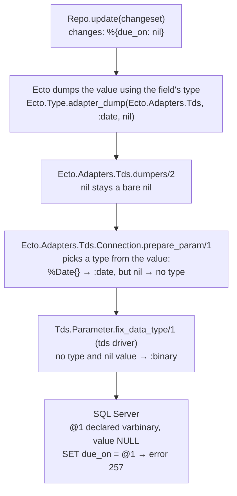

# Root cause

## Symptom

Writing `nil` to some columns through Ecto fails on SQL Server:

```
** (Tds.Error) Line 1 (Error 257): Implicit conversion from data type varbinary to date is not allowed. Use the CONVERT function to run this query.
```

For `float`, `real`, `text` and `ntext` columns the message is different:

```
** (Tds.Error) Line 1 (Error 206): Operand type clash: varbinary is incompatible with float
```

It happens whenever a query carries `nil` as a parameter: `Repo.update/2`
changing a field to nil, `Repo.insert_all/3` with a nil value, or
`Repo.update_all/3` setting a field to nil.

## Where the type gets lost

SQL Server needs every query parameter declared with a type. Ecto knows each
field's type from the schema, but on released ecto_sql that knowledge doesn't
survive to the point where parameters are declared:



The `:binary` fallback dates from 2018, when it fixed an Ecto `has_one`
nullify case: foreign keys are integers, and SQL Server does accept a varbinary
NULL for integer columns. See [upstream-history.md](upstream-history.md).

## Why only some column types fail

Whether SQL Server accepts a varbinary NULL depends on the column type.
`mix run scripts/conversion_matrix.exs` prints the full table; in short:

| Refuses a varbinary NULL | Accepts it |
|---|---|
| `date`, `time`, `datetime2`, `datetimeoffset` (error 257) | `datetime`, `smalldatetime` |
| `float`, `real`, `text`, `ntext` (error 206) | `int`, `bigint`, `bit`, `decimal`, `money` |
| | `nvarchar`, `varchar`, `uniqueidentifier`, `varbinary`, `image` |

Combined with the column types Ecto's migrations create, this is which schema
fields break on released ecto_sql:

| Ecto field type | Column Ecto creates | Setting it to nil |
|---|---|---|
| `:date` | `date` | fails |
| `:time` | `time(0)` | fails |
| `:time_usec` | `time(6)` | fails |
| `:naive_datetime` | `datetime` | works |
| `:naive_datetime_usec` | `datetime2(6)` | fails |
| `:utc_datetime` | `datetime` | works |
| `:utc_datetime_usec` | `datetime2(6)` | fails |
| `:float` | `float` | fails |
| `:integer`, `:boolean`, `:decimal`, `:string`, `:binary`, `:binary_id`, `:map` | `int`, `bit`, `decimal`, `nvarchar`, `varbinary`, `uniqueidentifier`, `nvarchar(max)` | works |

`timestamps()` uses `:naive_datetime` by default, which maps to the legacy
`datetime` type. That is a large part of why the bug is easy to miss.

Columns created by hand or by other tools follow the first table instead. For
example, a `:string` field on a legacy `text` column also fails, and so does a
`:date` field on a `datetime2` column that was declared outside Ecto.

## Why plain inserts don't fail

`Repo.insert/2` only includes struct fields that aren't nil, so no parameter
is sent for them and the column gets its default of NULL. Only writes that
explicitly carry a nil hit the bug.

## Why the driver can't fix it

By the time a nil reaches the tds driver it is just `nil`, with no type. Any
fallback type breaks some column: `:binary` (today) breaks the columns above,
and `:string`, proposed in tds#162, breaks `binary` and `varbinary` columns.
The conversion matrix shows both.

## The fix

`Ecto.Adapters.Tds.dumpers/2` is the last point where the field's type is
known. The fix (commit `4d570f4`, in
[`vendor/ecto_sql/lib/ecto/adapters/tds.ex`](../vendor/ecto_sql/lib/ecto/adapters/tds.ex)) wraps
nil for the affected Ecto types in a `%Tds.Parameter{}` with an explicit type.
The adapter passes typed parameters straight through, and the driver only
falls back to `:binary` when there is no type.

| Ecto field type | NULL is sent as |
|---|---|
| `:date` | `date` |
| `:time`, `:time_usec` | `time` |
| `:naive_datetime`, `:naive_datetime_usec` | `datetime2` |
| `:utc_datetime`, `:utc_datetime_usec` | `datetimeoffset` |
| `:float` | `float` |

These are the same types ecto_sql already declares for non-nil values of those
fields, so no new conversions are introduced. Every other type is unchanged.

The test suite covers what this fixes, what it doesn't, and that nothing else
changes; see the README.
